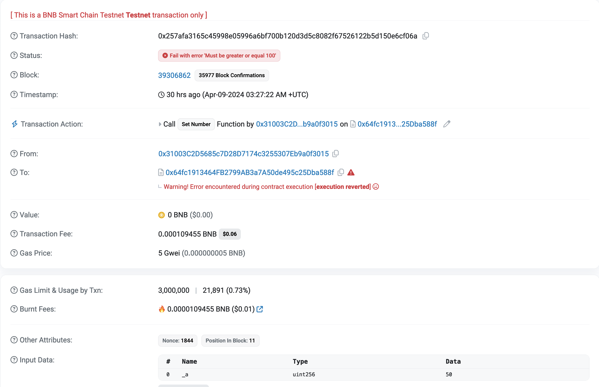
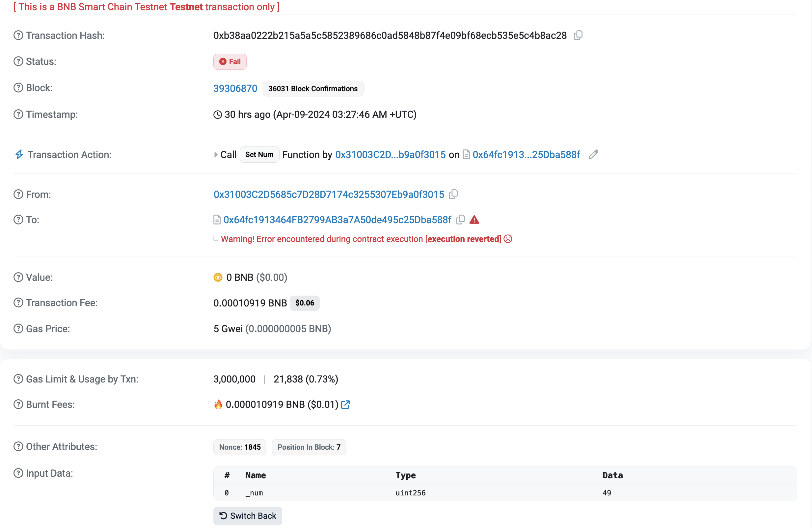

# Reports for vulnerability assessment

## Stats
- Critical: 6
- Medium: 3

## Static analysis

- Running with slither
```bash
slither ./contracts/ --solc-remaps @openzeppelin=.deps/npm/@openzeppelin
```
- Slither found 2 reentry vulnerabilities in the contracts (critical)
    - KIPNode.public_mint
    - KIPNode.whitelist_mint

## Logic (by Quang)

1. Avoid hardcode settings in the constructor (Med)

- Problems: as title

```solidity
constructor(address initialOwner, address pay_token)
    ERC721("TEST kip checker node", "KIPNODE")
    Ownable(initialOwner)
{
    payToken = IERC20(pay_token);
    payTokenAddress = pay_token;

    KIPFundAddress = 0x6E3bbb13330102989Ac110163e4C649d0bB88777;
    TransferEnabled = false;
    MaxTierAmount = 38;
}
```

- How to solve:
  - ERC-721's `tokenName` and `tokenSymbol`
    - Fixed naming: both Development and Production
    - Development and Production using a different name:
      - Passing params into `constructor`
  - `kipFundAddr` and `maxTierAmount` should be initialized through `constructor` params
  - `transferEnabled`: remove this line due to gas wasting to initialize a default value. Local or state variables always have default values (boolean default = `false`).

2. Free minting and gas wastage (critical)

Problems:
  - When `amount = 0`: Users pay transaction gas for nothing.
  - There are a total of four `require` checks (timestamp and cap minting allowance), leading to gas wastage.
  - If `tierPrice = 0`: tokens are minted for free (**CRITICAL**)
  - Un-neccessary checkings:
    - Checking allowance: `require(payToken.allowance(_msgSender(), address(this)) >= _price, "Allowance is less than transfer amount")`
    - Checking whether transfer successful or not:
      - `bool success = payToken.transferFrom(_msgSender(), address(this), _price);`
      - `require(success, "Failed to transfer funds");`

```solidity
function public_mint(uint8 tier, address to, uint8 _amount, string calldata _code) public {
    require(tier>0, "tier Can't BE ZERO");
    require(tier<=MaxTierAmount, "tier TOO LARGE");
    require(user_minted_amounts_public[tier][_msgSender()] + _amount <= tier_user_cap_public[tier], "Can't mint more than allowed");
    require(tier_minted_amounts_public[tier] + _amount <= tier_total_cap_public[tier], "Cannot mint more than allowed");
    require(tier_start_timestamp_public[tier] <= block.timestamp, "start_timestamp not allowed");
    require(block.timestamp <= tier_end_timestamp_public[tier], "end_timestamp not allowed");

    if(tier_price_per_token[tier]>0){
        uint256 _price = tier_price_per_token[tier]*_amount;
        require(payToken.allowance(_msgSender(), address(this)) >= _price, "Allowance is less than transfer amount");
        bool success = payToken.transferFrom(_msgSender(), address(this), _price);
        require(success, "Failed to transfer funds");
    }

    for (uint256 i = 1; i <= _amount; i++) {
        _nextTokenId++;
        _safeMint(to, _nextTokenId);
        emit TokenMinted(false, tier, to, _nextTokenId, _code);
    }
    tier_minted_amounts_public[tier] += _amount;
    user_minted_amounts_public[tier][_msgSender()] += _amount;
}
```

- How to solve:
  - Add `require(amount != 0, "Minting amount is zero");`
  - Combine them into one or two `require` checkings
  - Add a `require` check when `tierPrice` is not yet set
  - Remove them to save gas:
    - Legitimate ERC-20 tokens typically include these checks.
    - Analyze the payment token contract and ensure its legitimacy before setting it as a payment method in the contract.

3. Collision Proof (critical)

Avoid using `abi.encodePacked()` with `keccak256()` when generating proof or signing hash

- Problem: `bytes32 leaf = keccak256(abi.encodePacked(to, maxAmount));`

```solidity
pragma solidity ^0.8.0;

contract Collision {
    // data = "abcdabcdabcdabcdabcdabcdabcdabcd"
    // Return: 0x5b38da6a701c568545dcfcb03fcb875f56beddc46162636461626364616263646162636461626364616263646162636461626364
    function encode1(string calldata data) external view returns (bytes memory) {
        return abi.encodePacked(msg.sender, bytes(data));
    }

    // num = 44048183304063887187859370839104322756173613274888048543432839607116120613732
    // Return: 0x5b38da6a701c568545dcfcb03fcb875f56beddc46162636461626364616263646162636461626364616263646162636461626364
    function encode2(uint256 num) external view returns (bytes memory) {
        return abi.encodePacked(msg.sender, num);
    }
}
```
- How to solve: using `abi.encode()` instead

4. Unnecessary storage variables (minior)

- Problems: redundant storage states -> waste gas

```solidity
    IERC20 private USDT_Token; // usdt token
    address public USDT_TokenAddress; 

    IERC20 private USDC_Token; // usdc token
    address public USDC_TokenAddress; 
```
- How to solve:
  - Define only one as public `IERC20 public USDT_Token`


5. Solidity storage layout ([doc](https://docs.soliditylang.org/en/v0.8.25/internals/layout_in_storage.html)) (critical)

- Each storage slot is 256-bits (32 bytes)
- Compact multiple state variables in one slot when:
  - These variables are fit into one slot
  - These variables always access at the same time

```
bool public TransferEnabled;
uint16 public MaxTierAmount;
```

- Problem: Gas wastage (init cost savings, but wastage on each access).
- How to solve:
  - Change `uint16 public MaxTierAmount;` into `uint256 public maxTierAmount;`
  - Move `transferEnabled` after mappings

```
mapping(uint16 => uint256) public tier_price_per_token;

mapping(uint16 => uint64) public tier_start_timestamp_public;
mapping(uint16 => uint64) public tier_end_timestamp_public;

mapping(uint16 => uint64) public tier_start_timestamp_whitelist;
mapping(uint16 => uint64) public tier_end_timestamp_whitelist;

mapping(uint16 => uint16) public tier_total_cap_public;
mapping(uint16 => uint16) public tier_user_cap_public;

mapping(uint16 => uint16) public tier_total_cap_whitelist;
mapping(uint16 => bytes32) public tier_whitelist_merkle_root;

mapping(uint16 => mapping(address => uint256)) public user_minted_amounts_whitelist;
mapping(uint16 => mapping(address => uint256)) public user_minted_amounts_public;

mapping(uint16 => uint16) public tier_minted_amounts_public;
mapping(uint16 => uint16) public tier_minted_amounts_whitelist;
```

- Problem: inefficient storage layout, and too many mappings
- How to solve:
  - Define a struct data for `public` and `whitelist` type.
  - Compact data into a slot to optimize storage layout.

```solidity
struct PublicSale {
  uint256 price;
  uint32 maxPerTier;
  uint32 maxPerUser;
  uint64 mintedAmount;
  uint64 start;
  uint64 end;
}

struct WhitelistSale {
  uint256 merkleRoot;
  uint64 maxPerTier;
  uint64 mintedAmount;
  uint64 start;
  uint64 end;
}

mapping(address => mapping(uint256 => uint256)) public whitelistUserMinted;
mapping(address => mapping(uint256 => uint256)) public publicUserMinted;
mapping(uint256 => PublicSale) public publicSaleConfigs;
mapping(uint256 => WhitelistSale) public whitelistSaleConfigs;

//  Also update logic in publicMint() and whitelistMint()
//  Note: Passing params into a function should also use 256-bits
```

- `public` vs `external`
  - `public` functions can be called both externally (via transaction) and internally
  - `external` functions can only be called externally (via transaction)
  - `checkWhitelistMint()` is being called by another function in the contract; hence, it should be defined as `public`.
  - Other functions should be defined as `external`
  - Note: `external` functions are slightly cheaper than `public` functions

```
event TokenMinted(bool whitelist, uint8 tier, address to, uint256 token_id, string _code);
```

- Purpose of emitting events:
  - Indicate transactions' finality.
  - Store logging information.
  - Send message to external clients (outside of the blockchain).
  - Note: `string` data in the event will be hashed
  - Define `indexed` for indexing and querying purpose
- How to solve:
  - Review the event above and and retain necessary information.

6. Potential for High Minting Gas Costs and Transaction Failures (med)

## Design suggestions

The current implementation of `MyToken.sol` is tied to ERC-721 minting with pre-sale events. This contract's logic may become outdated after these events, rendering it unable to mint additional NFTs without sale settings. Thus, contract functionalities should be reviewed, and if possible, features should be split into separate contracts.

### Potential for High Minting Gas Costs and Transaction Failures

```solidity
for (uint256 i = 1; i <= _amount; i++) {
    _nextTokenId++;
    _safeMint(to, _nextTokenId);
    emit TokenMinted(false, tier, to, _nextTokenId, _code);
}
```

- Problem: Users may incur substantial gas fees when minting with large `amount` values (e.g., 50, 100). This could result in transaction failures due to exceeding the `gas_limit` or `execution_time_out`.
- How to solve: use `ERC-1155` or `ERC-3525`
- For ERC-1155: Mint a single `tokenId` with the amount set to 50,000.
- ERC-3525:
    - Assign `slotId = 0` for License NFTs.
    - `amount` minting is equivalent to `value` data type of ERC-3525

### Solidity style convention ([Style Guide](https://docs.soliditylang.org/en/latest/style-guide.html))


### Require checking error string vs Custom error:

- Many auditing services recommend using `Custom Error` instead of `String Error` due to:

  - Enhanced developer user experience
  - Gas cost savings

- However, there is a trade-off when implementing `Custom Error` – it may not be user-friendly for customers or users. Please try to deploy this example contract on the testnet and send a transaction that triggers an error.

```solidity
pragma solidity ^0.8.0;

error LessThan(uint256 number);

contract Example {
    uint256 public num;

    error GreaterThan(uint256 number);

    function setNum(uint256 num_) external {
        if (num_ < 100) revert LessThan(num_);
        else if (num_ > 500) revert GreaterThan(num_);

        num = num_;
    }

    function setNumber(uint256 num_) external {
        require(num_ >= 100, "Must be greater or equal 100");

        num = num_;
    }
}
```

- The `stringErrMsg` will be displayed on the blockchain explorer, while custom errors won't be explicitly displayed

  
  
  

- The smart contract is currently using `Openzeppelin v5.0.0` that is using `custom error`. Please consider to choose proper libraries for your case